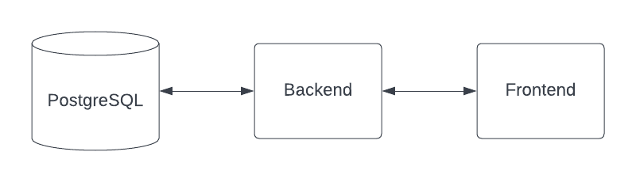

# Pre-Test Bootcamp DevOps

## knowledge base

1. Apa yang anda ketahui tentang DevOps?
2. Apa yang anda ketahui tentang Infrastructure?
3. Apa yang anda ketahui tentang server, sebutkan implementasi berserta contohnya?
4. Mengapa server dibutuhkan dalam pengembangan/development suatu software?
5. Apa yang anda ketahui mengenai Virtualisasi dan Container?
6. Mengapa teknology container saat ini sangat populer?
7. Apa yang anda ketahui tentang Orchestration Container System?

Cara pengerjaan, silahkan update file ini tulis jawabanya di bawah ini
1. Devops adalah adalah suatu culture/kebudayaan/pola kerja yang melakukan proses 
build, test, dan release perangkat lunak dengan cara menjembatani kolaborasi antar
tim developer operation hingga manajemen dan meningkatkan produk yang stabil dalam
waktu yang lebih cepat.
2. yang saya tahu tenatang infrastructure ada kata lain yaitu (IAC) Infrastructure as Code 
 yaitu sebuah produk dalam kode yang dapat diprogram, distandardisasikan, dan mudah untuk diduplikasi.
3. server adalah suatu sistem komputer yang memberikan layanan berupa menyimpan beragam jenis data
yang disimpan melalui server berupa beragam jenis informasi yang kompleks. dan contoh dari server yaitun salah satunya
"web server" yaitu sebuah jaringan komputer yang menerima kode sedemikian rupa dari browser lalu mengirimnya kembali 
dalam bentuk laman web. Laman web tersebut dikirim oleh web server dalam bentuk dokumen HTML dan CSS yang kemudian diproses 
oleh browser menjadi laman-laman web yang menarik dan mudah dibaca oleh pengguna.
4. karena jikalau suatu software itu tidak ada server maka bisa dikatakan software tersebut tidak akan bisa dipakai karena
tidak ada sekumpulan informasi atau data yang dapat disimpan atau didiperoleh software tersebut.
5. 1). Virtualisasi yaitu virtual machine yang dapat membuat beberapa komputer virtual dalam satu mesin server
   2). Container yaitu paket atau aplikasi yang mengandalkan isolasi virtual untuk menjalankan aplikasi yang dapat menjalankan 
       sistem operasi kernel secara simultan tanpa memerlukan mesin virtual (VMs).
6. karena Container menyediakan fleksibilitas secara keseluruhan dibandingkan menggunakan virtual machine. Container dapat langsung 
berjalan diatas sistem operasi tanpa menggunakan hypervisor. Container juga dapat membagi resource pada OS beserta fungsinya. hal ini 
sangat menguntungkan secara performa dan penggunaan resource dikarenakan aplikasi yang digunakan hanya menggunakan resource berdasarkan 
apa yang dipakai saja.
7. Container orchestration yaitu sebagai solusi untuk deployment, scaling, load balancing dan operasi lainnya untuk menjalankan layanan dan
beban kerja dalam container.
## Task 1 (Virtualization)

- Buatlah sebuah VM dengan kententuan
  - username: `<github_user>` contoh `dimasm93`
  - hostname: `<email_without_at>` contoh `dimas.tabeldata.com`
  - OS: `ubuntu-20.04` atau `centos-7`
- Install webserver `nginx`
- Buatlah web profile temen-temen kemudian deploy ke webserver nginx tersebut yang telah di deploy
  
(kirimkan hasil screenshotnya simpan dalam folder `screenshot` dengan nama `task1.png`)

## Task 2 (Container)

Jika saya memiliki architecture seperti berikut:

Dimana berikut adalah configurasi docker image:

1. Backend container
  - image: `dimmaryanto93/udemy-springboot-app:latest`
  - port: `8080`
  - env: 
    - `DATABASE_HOST`: `<ip-domain-db>`
    - `DATABASE_PORT`: `5432` 
    - `DATABASE_NAME`: `<db-name>`
    - `DATABASE_PASSWORD`: `<db-password>`
    - `APPLICATION_PORT`: `8080`
  need:
    - Database PostgreSQL v14.2
2. Frontend container
  - image: `dimmaryanto93/udemy-angular-app:latest`
  - port: `80`
  - env:
    - `APPLICATION_PORT`: `80`
    - `NGINX_ROOT_DOCUMENT`: `/var/www/html`
    - `BACKEND_HOST`: `<ip-backend-apps>`
    - `BACKEND_PORT`: `<port-backend-apps>`
    - `BACKEND_CONTEXT_PATH`: `/`
  - need:
    - Backend container

Silahkan buat docker-compose filenya, kemudian simpan dalam folder `tasks` dengan nama `docker-compose.yaml`

